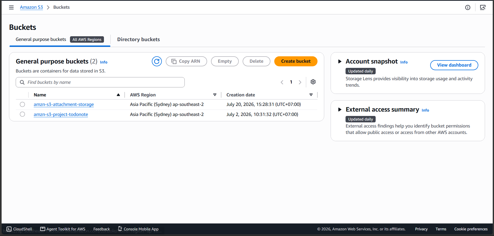
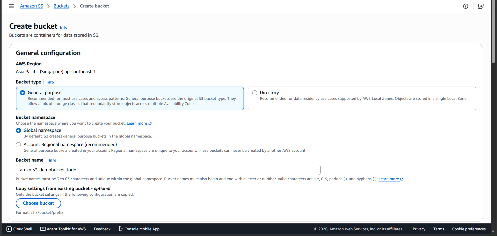
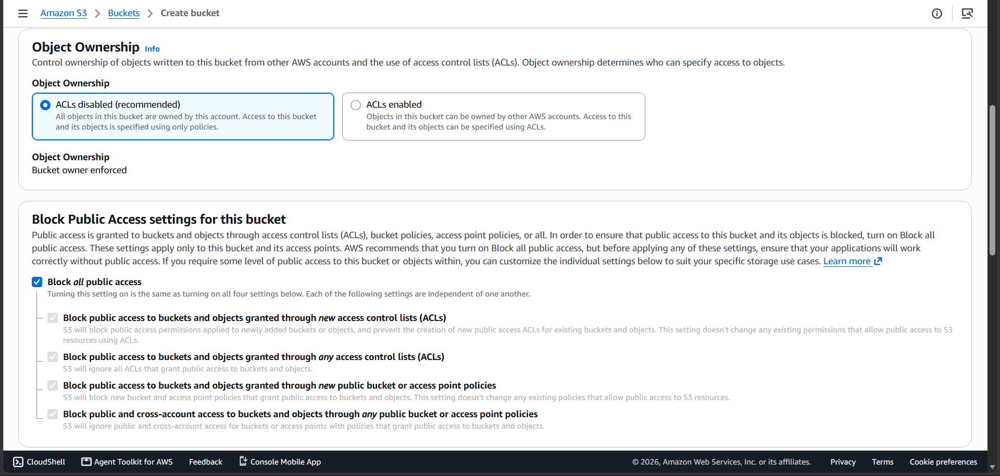
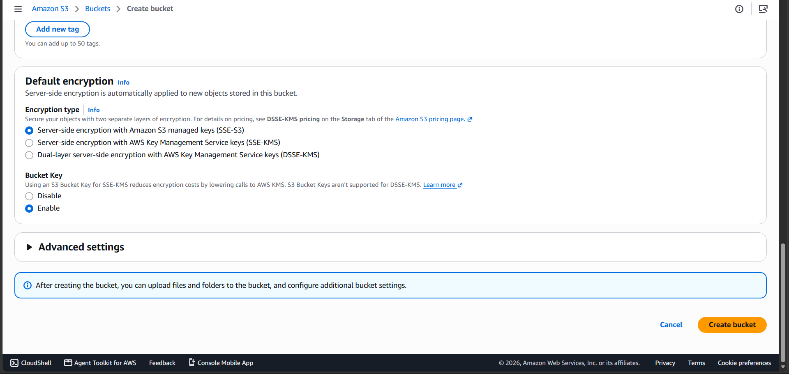

#### Mục đích
Bước đầu tiên để lưu trữ mã nguồn tĩnh Frontend (HTML, CSS, JS của React/Vite) là tạo một Amazon S3 Bucket. Điều quan trọng trong kiến trúc này là chúng ta sẽ **không** mở quyền truy cập công khai (Public Access) cho Bucket này, nhằm đảm bảo an toàn tuyệt đối và ép buộc người dùng phải truy cập qua CloudFront.

#### Các bước thực hiện

1. Đăng nhập vào **AWS Management Console** và tìm kiếm dịch vụ **S3**.
2. Tại bảng điều khiển S3, nhấp vào nút **Create bucket** màu cam.

3. Trong phần **General configuration**, thiết lập các thông tin sau:
   * **AWS Region:** Chọn `ap-southeast-1` (Singapore) để tối ưu độ trễ.
   * **Bucket name:** Đặt tên cho bucket của bạn. Tên này phải là duy nhất trên toàn cầu (ví dụ: `amzn-s3-demobucket-todo`).

4. Tại mục **Object Ownership**, giữ nguyên tùy chọn mặc định là **ACLs disabled (recommended)**.
5. Tại mục **Block Public Access settings for this bucket**:
   * **Đảm bảo đã tích chọn mục "Block *all* public access".** Đây là thao tác bắt buộc để giữ cho bucket ở trạng thái Private.

6. Các cấu hình còn lại thì bạn có thể giữ nguyên mặc định.
7. Kéo xuống cuối trang và nhấp vào nút **Create bucket**.

Sau khi tạo thành công, bạn sẽ thấy bucket của mình xuất hiện trong danh sách với nhãn `Buckets and objects not public`. Hãy chuyển sang bước tiếp theo để cấu hình CloudFront phân phối nội dung từ bucket Private này.