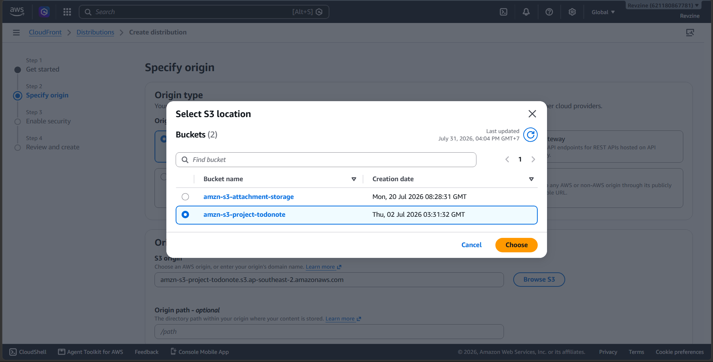
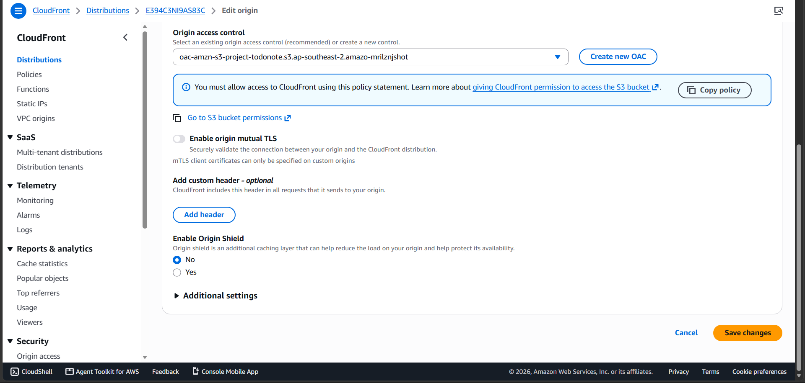

#### Mục đích
Sử dụng Amazon CloudFront làm Mạng phân phối nội dung (CDN) để tăng tốc độ tải trang trên toàn cầu. Thay vì mở Public cho S3, chúng ta sẽ sử dụng cơ chế xác thực **OAC (Origin Access Control)** để cấp quyền cho phép CloudFront đọc dữ liệu từ S3 một cách bảo mật.

#### Các bước thực hiện

1. Truy cập dịch vụ **CloudFront** trên AWS Management Console và nhấn nút **Create a CloudFront distribution**.
2. Tại mục **Origin**:
   * **Origin domain:** Nhấp vào ô trống và chọn tên S3 Bucket bạn vừa tạo ở bước 5.3.1.
   * **Origin access:** Chọn **Origin access control settings (recommended)**.
   * Nhấn nút **Create control setting**, giữ nguyên các thông số mặc định trong bảng hiện ra và nhấn **Create**.

3. Tại mục **Web Application Firewall (WAF)**:
   * Chọn **Do not enable security protections** (để tránh phát sinh chi phí không cần thiết trong khuôn khổ của workshop này).
4. Nhấn nút **Create distribution**.

5. Ngay sau khi Distribution được tạo thành công, CloudFront sẽ hiển thị một thanh thông báo màu xanh lam (Banner) ở phía trên cùng, yêu cầu bạn cập nhật **S3 bucket policy**.

* Hãy nhấn vào nút **Copy policy** (hoặc sao chép đoạn mã JSON hiển thị trên màn hình). Chúng ta sẽ lưu tạm đoạn mã này và sử dụng nó ở bước tiếp theo (5.3.3) để cấp quyền thực sự cho CloudFront truy xuất vào S3.

Nếu bạn không tìm thấy thì có thể vào Origins -> Edit. Sau đó tạo OAC cho S3 vừa tạo nếu chưa có và bấm vào **Copy Policies**

