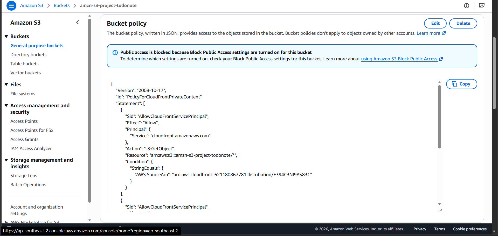
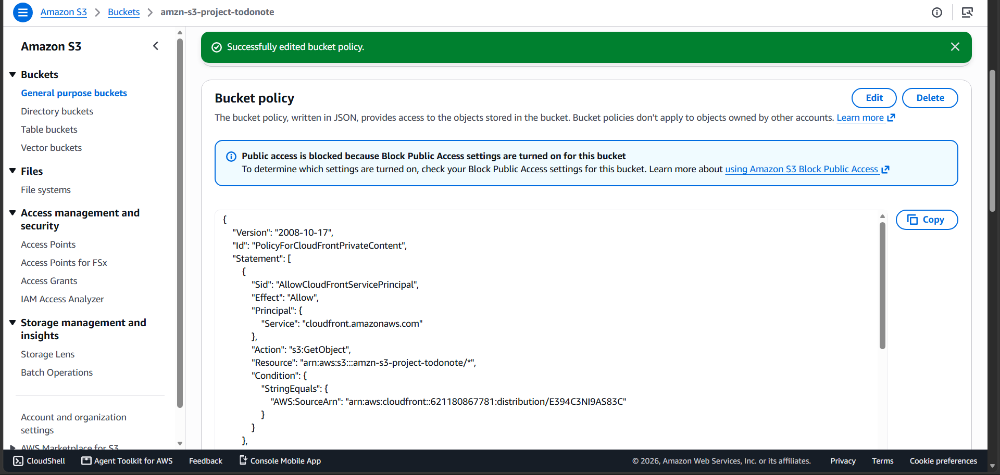

#### Mục đích
Mặc dù CloudFront đã được cấu hình OAC để có thể truy cập S3 một cách bảo mật, bản thân S3 Bucket mặc định vẫn sẽ từ chối mọi yêu cầu truy cập từ bên ngoài. Chúng ta cần cập nhật **Bucket Policy** bằng đoạn mã JSON đã copy ở bước trước để chính thức cho phép CloudFront đọc dữ liệu.

#### Các bước thực hiện

1. Mở một tab mới, truy cập vào dịch vụ **S3** trên AWS Management Console.
2. Từ danh sách Buckets, nhấp vào tên S3 Bucket frontend mà bạn đã tạo ở bước 5.3.1.
3. Chuyển sang tab **Permissions** (Quyền).
4. Cuộn xuống phần **Bucket policy** và nhấp vào nút **Edit** (Chỉnh sửa).

5. Trong khung soạn thảo **Policy**, hãy xóa bất kỳ nội dung cũ nào (nếu có) và **Dán (Paste)** đoạn mã JSON mà bạn đã copy từ CloudFront ở bước 5.3.2 vào đây.

6. Cuộn xuống cuối trang và nhấp vào nút **Save changes** (Lưu thay đổi).

Sau khi lưu thành công, bạn sẽ thấy thông báo màu xanh lá cây xác nhận policy đã được cập nhật. Lúc này, luồng phân phối CDN từ CloudFront qua S3 đã hoàn toàn thông suốt và bảo mật.