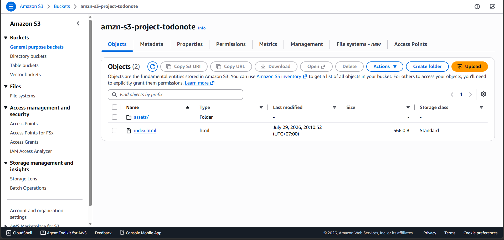
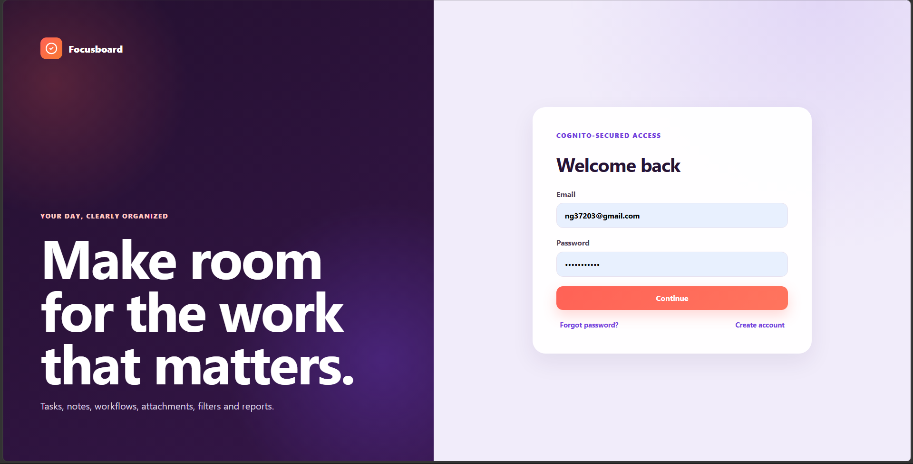

#### Mục đích
Mã nguồn Frontend (React/Vite) cần được biên dịch (build) thành các file tĩnh (HTML, CSS, JS) trước khi đưa lên môi trường thực tế. Bước này hướng dẫn bạn cách build source code ở máy tính local và tải các file tĩnh đó lên S3 Bucket để website chính thức hoạt động thông qua CloudFront.

#### Các bước thực hiện

1. **Biên dịch mã nguồn (Build source code):**
   * Mở Terminal (hoặc Command Prompt) và điều hướng đến thư mục chứa mã nguồn Frontend của bạn.
   * Chạy lệnh sau để cài đặt các thư viện cần thiết (nếu bạn chưa cài):
     ```bash
     npm install
     ```
   * Chạy lệnh sau để tiến hành đóng gói dự án:
     ```bash
     npm run build
     ```
   * Sau khi chạy xong, hệ thống sẽ tự động tạo ra một thư mục mới có tên là `dist` (đối với Vite). Thư mục này chứa toàn bộ các file tĩnh đã được tối ưu.

2. **Upload lên S3 Bucket:**
   * Mở trình duyệt, truy cập dịch vụ **S3** trên AWS Console và mở bucket mà bạn đã tạo ở bước 5.3.1.
   * Nhấp vào nút **Upload** (Tải lên).
   * Nhấp vào **Add files** và **Add folder** để chọn **toàn bộ nội dung bên trong** thư mục `dist`. 
   * *Lưu ý quan trọng: Bạn phải upload các file bên trong chứ không upload cả thư mục `dist`. Đảm bảo file `index.html` nằm ở ngay thư mục gốc của bucket.*
   * Cuộn xuống dưới cùng và nhấp vào nút **Upload**. Đợi vài phút để quá trình tải lên hoàn tất, sau đó nhấn **Close**.



3. **Kiểm tra thành quả:**
   * Mở dịch vụ **CloudFront** trên AWS Console.
   * Tìm Distribution bạn đã tạo ở bước 5.3.2 và sao chép đường dẫn tại cột **Domain name** (ví dụ: `d123456...cloudfront.net`).
   * Mở một tab mới trên trình duyệt và dán đường dẫn này vào. Bạn sẽ thấy giao diện trang web Frontend của mình được tải lên nhanh chóng và bảo mật qua giao thức HTTPS!

