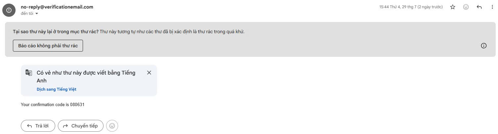
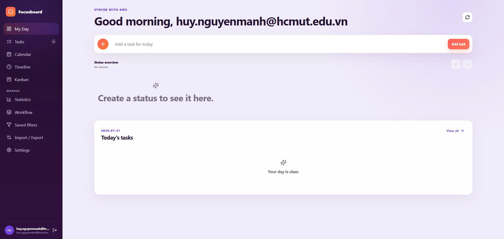

Trong mục này, chúng ta tiến hành kiểm thử các thao tác CRUD (Create, Read, Update, Delete) cho công việc và ghi chú trực tiếp trên giao diện Web UI, đồng thời xác minh trạng thái đồng bộ dữ liệu tại cơ sở dữ liệu Amazon DynamoDB.

---

#### 1. Kiểm thử Thao tác CRUD trên Giao diện Web UI (Kanban Board)

* **Các bước thực hiện:**
  1. Nhấn nút **Create New Task** trên giao diện Web để khởi tạo công việc/ghi chú mới.
  2. Nhập Tiêu đề, Nội dung mô tả, chọn Danh mục, Gán thẻ và chọn Ngày hết hạn.
  3. Bấm **Save Task** để lưu dữ liệu.
  4. Thực hiện chuyển đổi trạng thái bằng cách kéo thả (Drag-and-Drop) thẻ công việc từ cột *In Progress* sang *Completed* trên bảng **Kanban Board**.
  5. Thử nghiệm chỉnh sửa nội dung và nhấn **Delete** để xóa thử nghiệm một ghi chú.

* **Kết quả kỳ vọng:**
  * Giao diện phản hồi mượt mà, các thẻ công việc di chuyển đúng cột trạng thái ngay lập tức.
  * Các yêu cầu HTTP `POST /tasks`, `PUT /tasks/{id}`, `DELETE /tasks/{id}` gửi đến API Gateway trả về HTTP Status Code **`200 OK`** hoặc **`201 Created`**.

---

#### 2. Xác minh Dữ liệu Lưu trữ tại Amazon DynamoDB Table

* **Các bước thực hiện:**
  1. Truy cập **Amazon DynamoDB Console** -> Mở mục **Explore items**.
  2. Chọn bảng **`TodoNotesTable`**.
  3. Kiểm tra danh sách các bản ghi dữ liệu được tạo ra.

* **Kết quả kỳ vọng:**
  * Bảng DynamoDB lưu trữ đầy đủ các thuộc tính của công việc: `userId` (Partition Key), `taskId` (Sort Key), `title`, `description`, `status`, `category`, `createdAt`, `updatedAt`.
  * Dữ liệu phân quyền chính xác theo đúng chuỗi định danh `userId` của tài khoản Cognito đang đăng nhập.

