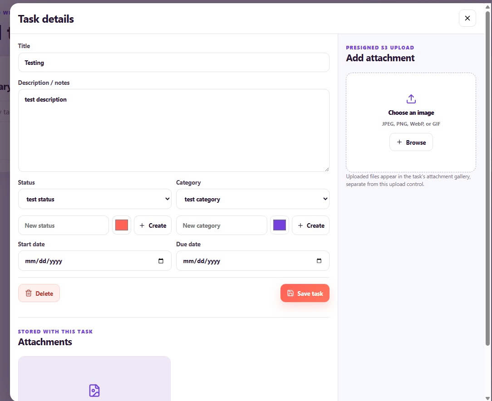

Trong mục này, chúng ta tiến hành kiểm thử tính năng tải tệp/hình ảnh đính kèm cho ghi chú thông qua cơ chế **S3 Presigned URL**. Giải pháp này cho phép Trình duyệt Client tải tệp nhị phân trực tiếp lên Amazon S3 mà không cần thông qua hàm Backend Lambda, giúp tối ưu băng thông và giảm độ trễ xử lý.

---

#### 1. Quy trình Kiểm thử Tải tệp đính kèm

1. **Thao tác trên Giao diện Web:**
   * Tại form Tạo mới hoặc Chỉnh sửa công việc/ghi chú, nhấn chọn đính kèm tệp hình ảnh (`.png` / `.jpg`).
   * Web Frontend tự động gửi request `POST /upload-url` tới API Gateway kèm theo Cognito JWT Token.
   * API Gateway xác thực thành công và chuyển tiếp request tới hàm Lambda để khởi tạo một đường dẫn **S3 Presigned URL** tạm thời (có thời hạn hết hạn trong 5 phút).

2. **Tải tệp trực tiếp lên S3:**
   * Trình duyệt sử dụng Presigned URL vừa nhận được và gửi phương thức HTTP `PUT` mang dữ liệu hình ảnh trực tiếp tới **S3 Attachments Bucket**.
   * Request hoàn tất thành công với HTTP Status Code **`200 OK`**.

---

#### 2. Xác minh Lưu trữ Tệp trên Amazon S3 Console

* **Các bước kiểm tra:**
  1. Truy cập **Amazon S3 Console** -> Mở `Attachments Bucket`.
  2. Truy cập vào đường dẫn thư mục tương ứng với chuỗi định danh `userId` của tài khoản đăng nhập.
  3. Kiểm tra sự xuất hiện của tệp hình ảnh đính kèm vừa được tải lên thành công.

* **Kết quả kỳ vọng:**
  * File ảnh đính kèm hiển thị đầy đủ trong S3 Bucket với kích thước và thuộc tính chuẩn xác.
  * Tệp ảnh được phân quyền truy cập an toàn, chặn truy cập công khai ngoài Presigned URL.

