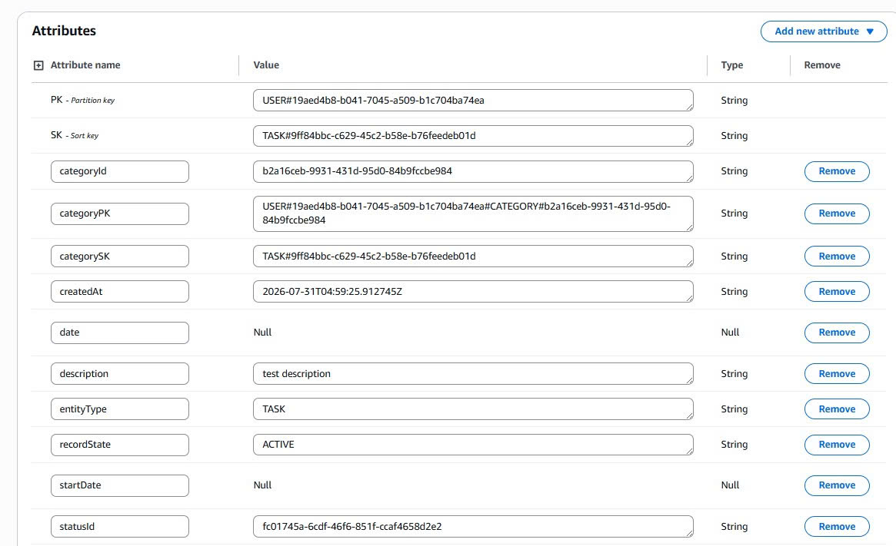
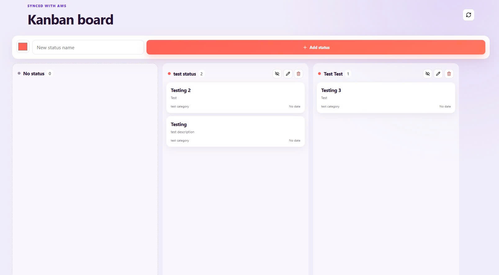

Trong phần này, chúng ta tiến hành kiểm thử tính an toàn của hệ thống tại tầng **Amazon API Gateway** bằng cách xác minh cơ chế **Cognito JWT Authorizer** (chặn truy cập không hợp lệ) và kiểm tra cấu hình **CORS (Cross-Origin Resource Sharing)**.

---

#### 1. Kiểm thử Chặn Truy cập Trái phép (401 Unauthorized)

* **Các bước thực hiện:**
  1. Mở công cụ Postman.
  2. Gửi một HTTP request `GET /tasks` đến URL endpoint của API Gateway nhưng **không truyền Header `Authorization`** (hoặc truyền chuỗi Token không hợp lệ).

* **Kết quả kỳ vọng:**
  * API Gateway lập tức từ chối request ở tầng Gateway mà không kích hoạt hàm Lambda backend.
  * Trả về HTTP Status Code **`401 Unauthorized`**.

---

#### 2. Kiểm thử Cấu hình CORS (Cross-Origin Resource Sharing)

* **Các bước thực hiện:**
  1. Gửi một HTTP **Preflight request (`OPTIONS`)** đến API Gateway endpoint để kiểm tra các Header điều kiện trả về cho Trình duyệt Web.

* **Kết quả kỳ vọng:**
  * API Gateway trả về HTTP Status **`200 OK`** cùng dãy Response Headers chứa cấu hình CORS hợp lệ: `Access-Control-Allow-Origin`, `Access-Control-Allow-Headers`, `Access-Control-Allow-Methods`.

