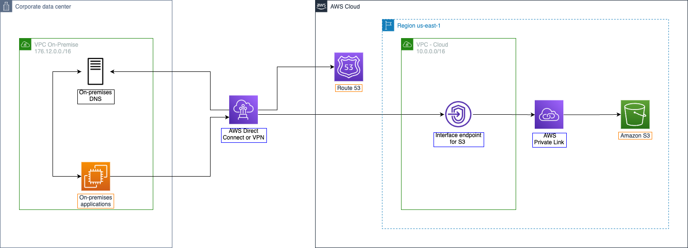

#### Tổng quan

+ Trong phần này, tạo một Interface Endpoint để truy cập Amazon S3 từ môi trường truyền thống mô phỏng. Interface Endpoint sẽ cho phép định tuyến đến Amazon S3 qua kết nối VPN từ môi trường truyền thống mô phỏng.

+ Lựa chọn **Interface Endpoint**:
    + Các Gateway endpoints chỉ hoạt động với các tài nguyên đang chạy trong VPC nơi chúng được tạo còn Interface Endpoint  hoạt động với tài nguyên chạy trong VPC và cả tài nguyên chạy trong môi trường truyền thống. Khả năng kết nối từ môi trường truyền thống với aws cloud có thể được cung cấp bởi AWS Site-to-Site VPN hoặc AWS Direct Connect.
    + Interface Endpoint cho phép kết nối với các dịch vụ do AWS PrivateLink cung cấp. Các dịch vụ này bao gồm một số dịch vụ AWS, dịch vụ do các đối tác và khách hàng AWS lưu trữ trong VPC của riêng họ (gọi tắt là Dịch vụ PrivateLink endpoints) và các dịch vụ Đối tác AWS Marketplace. Workshop này, ta sẽ tập trung vào việc kết nối với Amazon S3.
    

