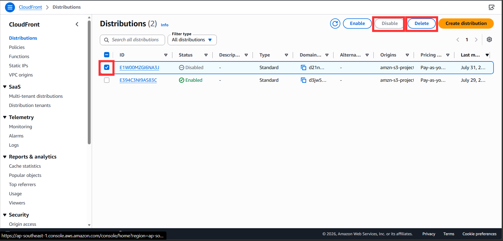
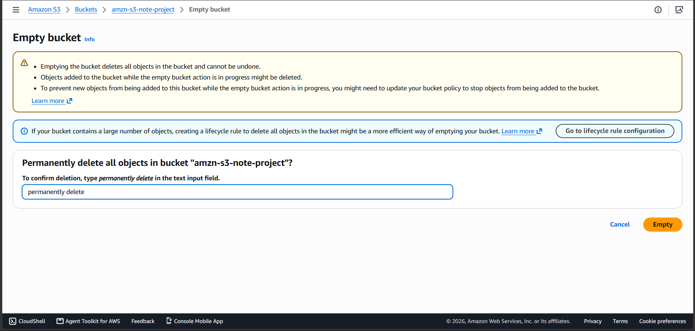
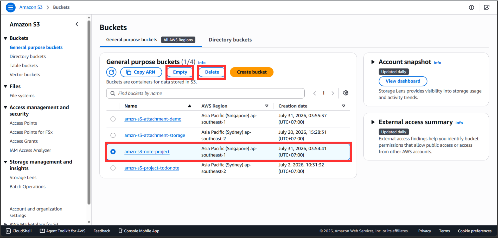
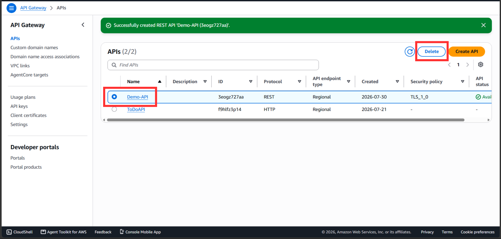
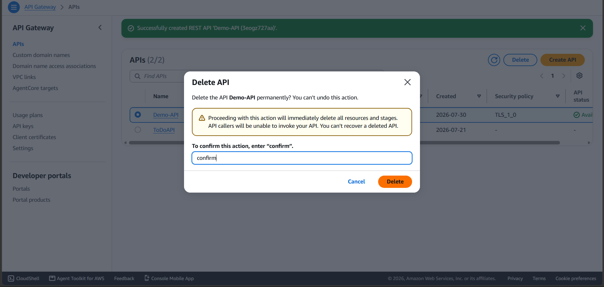
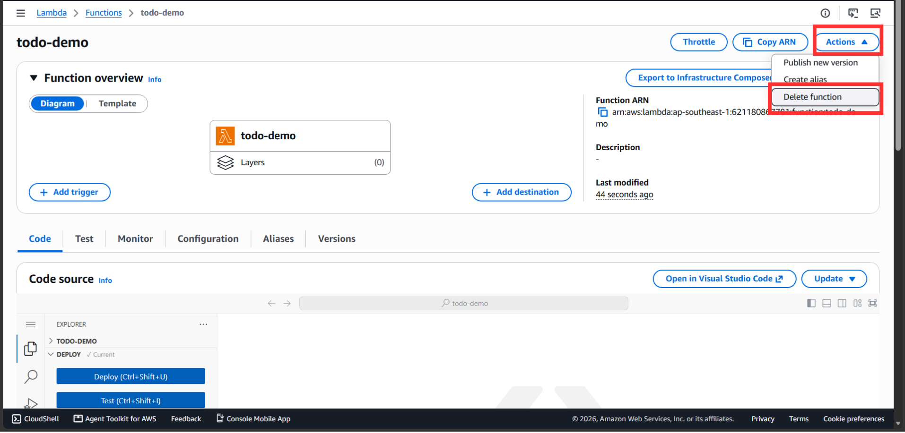
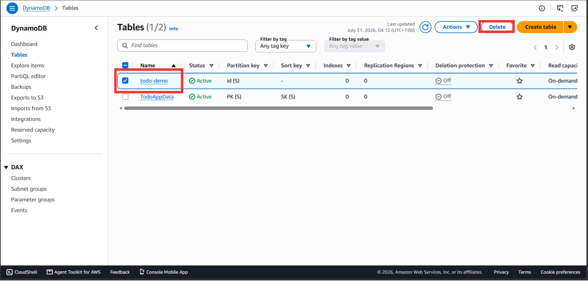
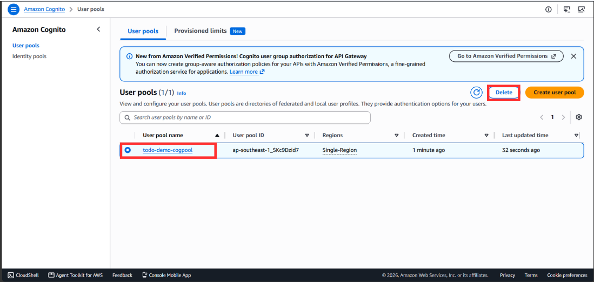

#### Dọn dẹp tài nguyên

Xin chúc mừng bạn đã hoàn thành xong workshop này!
Trong workshop này, bạn đã học cách xây dựng và triển khai một mô hình kiến trúc Web Serverless hoàn chỉnh và bảo mật trên AWS.

+ Bằng cách kết hợp Amazon S3, CloudFront và OAC, bạn đã phân phối giao diện web tĩnh với tốc độ cao và an toàn tuyệt đối mà không cần mở Public Access.
+ Bằng cách sử dụng Amazon Cognito, API Gateway, AWS Lambda và DynamoDB, bạn đã xây dựng một hệ thống Backend phi máy chủ mạnh mẽ, tự động mở rộng và tối ưu hóa chi phí vận hành.

#### Các bước dọn dẹp

1. **Vô hiệu hóa và xóa CloudFront Distribution**
Điều hướng đến dịch vụ CloudFront trên console. Chọn Distribution mà bạn đã tạo cho dự án này. Nhấp vào **Disable** (quá trình này có thể mất khoảng 3-5 phút). Sau khi trạng thái chuyển sang *Disabled*, chọn lại Distribution đó và nhấp vào **Delete**.

2. **Xóa các S3 bucket**
Mở bảng điều khiển S3. Chọn các bucket chúng ta đã tạo cho lab (bao gồm Frontend bucket và Attachment bucket). 
+ Đầu tiên, nhấp vào **Empty** để xóa toàn bộ file bên trong, xác nhận bằng cách gõ `permanently delete`.

+ Sau khi bucket đã trống, nhấp chọn lại bucket đó, nhấn **Delete** và xác nhận tên bucket để xóa hoàn toàn.

3. **Xóa API Gateway**
Mở bảng điều khiển API Gateway. Chọn API của dự án này, nhấp vào nút **Delete** ở góc trên và xác nhận thao tác xóa.

4. **Xóa hàm AWS Lambda**
Mở bảng điều khiển AWS Lambda. Đánh dấu tick vào hàm Lambda đã tạo, nhấn mục **Actions** trên thanh công cụ -> Chọn **Delete** và xác nhận.

5. **Xóa bảng DynamoDB**
Điều hướng đến dịch vụ DynamoDB, chọn **Tables** ở thanh menu bên trái. Chọn các bảng dữ liệu đã tạo, nhấp vào nút **Delete** và nhập từ khóa xác nhận theo yêu cầu của AWS.

6. **Xóa Amazon Cognito User Pool**
Mở bảng điều khiển Amazon Cognito. Chọn User Pool của dự án, điều hướng đến phần cài đặt của Pool, nhấp vào **Delete** và làm theo hướng dẫn xác nhận trên màn hình.

